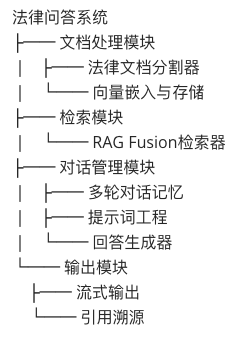
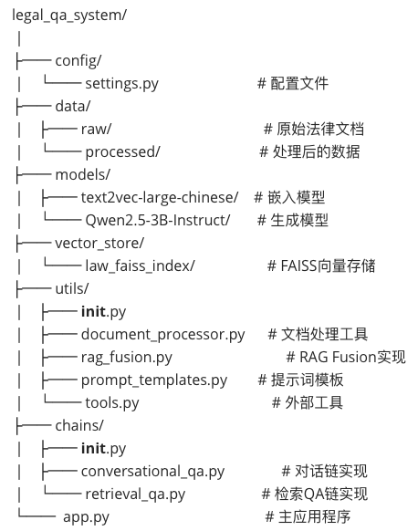
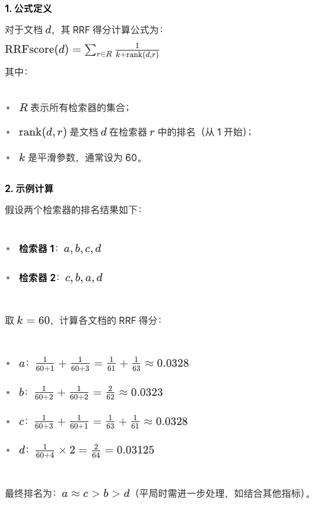

# **法律知识问答系统**

技术：Langchain、RAG Fusion、FAISS

问答模型：Qwen2.5-3B-Instruct

嵌入模型：text2vec-large-chinese

数据集：civil_code.pdf、penal_code.txt、corporation_law.docx

> GanymedeNil/text2vec-large-chinese 是一款专为中文语义理解优化的开源文本嵌入模型，基于 LERT（Language Encoder Representations from Transformers）架构构建，专注于中文文本的语义向量生成和相似度计算。
>
> 架构升级：基于 HFL（华为诺亚方舟实验室）的 chinese-lert-large 模型改造，替换传统 MacBERT 为 LERT 架构，融合词性标注、命名实体识别、语法依存等语言学特征，显著提升中文语义理解能力。
>
> 参数规模：采用 24 层 Transformer 编码器，隐藏层维度 1024，注意力头数 16，参数量约 326M，在性能与部署成本间取得平衡。
>
> 输入支持：最大序列长度 512 tokens，适合处理对话、短文本等场景，对长文本可通过截断或分块优化。


$$
我也可以谈，我也可以爱国。
$$


## 模块结构



> pycharm 自定义的包找不到的解决方案。文件 - 设置 - 项目 -项目结构 - 添加内容根，把需要的路径添加到内容根里面。
>
> 否则导入config文件会报错
>
> ```python
> from config.xxx import xxxx
> ```

## 项目结构



## 现实过程

1. 配置setting.py文件，设置基础路径、模型路径和数据路径等。
2. 文档处理脚本document_processor.py。按照法律文档特有的 “章→节→条” 层级结构拆分文本，并为每个拆分后的片段附加精确的元数据（如所属法律名称、章节标题、条款编号等）。
3. 向量存储。利用text2vec-large-chinese嵌入模型将文本分割所得的chunk向量化，存储到FAISS库中。
4. RAG Fusion 实现。

> RAG Fusion核心思想是通过**多查询生成 + 结果生成**。传统 RAG 通常仅基于用户 query 进行一次检索，返回最相关的少数文档片段。而 RAG Fusion 则通过以下步骤优化这一过程：
>
> 1）**多query生成**：对原始用户 query 进行变体扩展，生成多个语义相似但略有差异的查询语句。
>
> - 例如，对于 query “如何预防感冒”，可生成 “预防感冒的有效方法”“怎样避免患上感冒” 等变体。
>
> 2）**并行执行多查询检索**：将这些变体 query 分别输入检索系统，获取多组相关文档片段。
>
> 3）**融合多查询结果（生成最终排序）**：通过排序（RRF）算法将多个查询的召回结果“加权融合”打分、去重、排序等策略。
>
> 4）**融合优势**：一个文档若在多个查询结果中都排名靠前（如在查询 1 中排第 1、查询 2 中排第 3），其综合得分会显著高于 “仅在单个查询中排名靠前” 的文档，更能体现文档的 “普适相关性”。

​	倒秩融合算法（reciprocal_rank_fusion，RRF）的设计基于**排名位置的倒数加权**，其核心逻辑是：**在多个检索器中排名越靠前的文档，在最终排名中的优先级越高**。该方法通过以下步骤实现：

​	1）**独立检索**：多个检索器（如 BM25、向量检索、多模态模型）对同一查询生成各自的文档排名。

​	2）**倒数加权**：对每个文档在各检索器中的排名位置取倒数，并通过常数 *k* 进行平滑处理。

​	3）**分数聚合**：将所有检索器的倒数排名分数相加，得到最终得分并排序。



5. 配置提示词模版。
6. 配置QA问答链。专门用于基于检索到的法律文档（如法条、章节）生成带来源的问答结果，主要调用 Langchain 的RetrievalQA链 + 清理回答 + 提取来源。

通过LangChain的 `RetrievalQA.from_chain_type` 方法创建了一个**检索增强生成（RAG）问答链**，

- 以 `stuff` 链为核心，确保法律文档的完整传递和高效生成；
- 通过 `return_source_documents=True` 支撑来源追溯，满足法律领域的可解释性要求；

​	自定义对话内存，继承ConversationBufferWindowMemory类对话记忆。


7. 项目运行`streamlit run app.py`


